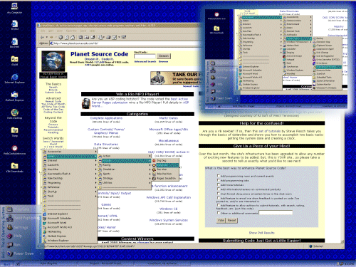



## BoS \- Replacement Shell \- Release Version

### Description

Who says you can't teach an old dog new tricks! Same old BoS, but now with a FULL start menu, including ALL of your programs from Explorer! Also, there are now constants for the path to your desktop and start menu folders! With all the features of the previous bos' - translucent windows, alpha shadows, desktop icons, skins, integrated popup messaging, an integrated skin downloader and more! Join my club at http://clubs.yahoo.com/clubs/tipshelpandmore
 
### More Info
 

             |
---                |---
**Submitted On**   |2000-04-19 18:31:50
**By**             |[Brian](https://github.com/Planet-Source-Code/PSCIndex/blob/master/ByAuthor/brian.md)
**Level**          |Advanced
**User Rating**    |4.5 (117 globes from 26 users)
**Compatibility**  |VB 5\.0, VB 6\.0
**Category**       |[Complete Applications](https://github.com/Planet-Source-Code/PSCIndex/blob/master/ByCategory/complete-applications__1-27.md)
**World**          |[Visual Basic](https://github.com/Planet-Source-Code/PSCIndex/blob/master/ByWorld/visual-basic.md)
**Archive File**   |[CODE\_UPLOAD49764192000\.zip](https://github.com/Planet-Source-Code/brian-bos-replacement-shell-release-version__1-7400/archive/master.zip)

